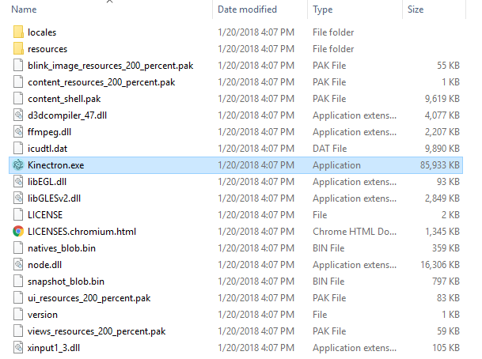
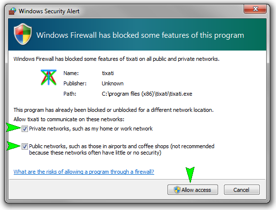
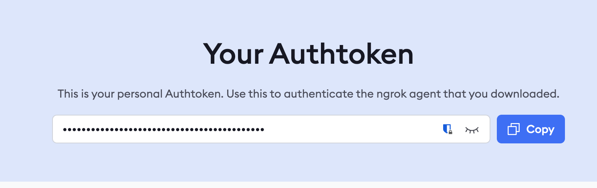
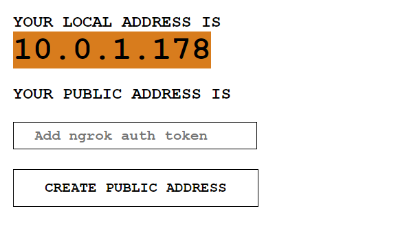
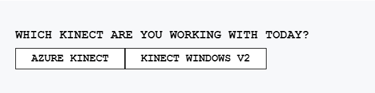
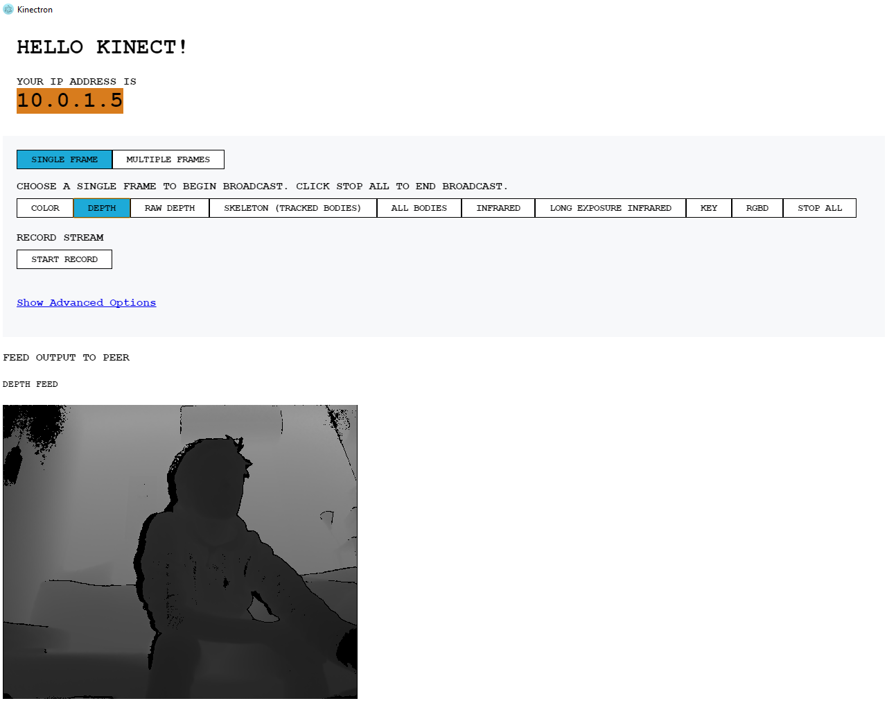

# Getting Started: Server

Kinectron has two components: a server that broadcasts Kinect data, and an API that receives Kinect data.

In this section we'll take a look at how to use the Kinectron server. The Kinectron server only runs on Windows, because it uses the Kinect SDK to run.

## Getting the Kinectron Server Up and Running

### 1. Kinectron Application Installation

You will need to be running Windows for the app to run correctly. If you are running Windows 8, and plan to use the Kinect Windows V2, you will also need to download and install the [Official Kinect2 SDK](https://www.microsoft.com/en-us/download/details.aspx?id=44561) before running Kinectron.

Download and unzip [preview release 0.3.9](https://github.com/kinectron/kinectron/releases/tag/0.3.9). Make sure you download the file that is linked from dropbox in the release description. The file will be labeled "Kinectron.xxxx.zip," you do not need the files labeled "Source Code."

Once the file downloads, unzip the folder close to the C:\ drive level to avoid an error with Windows filename size limitations.

### 2. Connect Your Kinect

Plug in your Kinect to your PC.

Kinectron runs with the Azure Kinect or Kinect Windows V2 (also referred to as Kinect One for Windows). It requires a USB3 attachment.

See the system requirements for each Kinect here: [Azure Kinect requirements](https://docs.microsoft.com/en-us/azure/kinect-dk/system-requirements) / [Windows Kinect requirements](https://support.xbox.com/en-US/xbox-on-windows/accessories/kinect-for-windows-v2-setup#e19e6aa4849b439590c3a7a8741933a9).

### 3. Open the Kinectron Application

In the unzipped Kinectron folder, double click on the Kinectron application to begin running the server.

**Important!** When you run the application for the first time you will get a Windows Firewall warning. Allow for both private and public networks to connect.

If you accidently cancel out of the notification, you can access the Firewall Settings in the following way:

Navigate to Settings > Network & Internet > Windows Firewall > Allow an app or feature through Windows Firewall

1. Click "Change Settings" on top right
2. Find Electron in the list
3. Check all three boxes for Electron (Electron, Private, Public)
4. Click Ok.

### 4. Optional! Create A Public Address

As of Kinectron version 0.3.4 you have the option to start a public address alongside your local address. The local address is an address on your local network and shows up by default. The public address exposes your Kinectron server on the public internet over https. You will use either your private or public address to connect your Kinectron client to your server.

The public address feature uses ngrok to create a secure tunnel to your application. To use it you will need to enter your own authtoken. To do this, create a free account at [https://ngrok.com/](https://ngrok.com/), and copy the authtoken that is automatically created for you.

Enter your authtoken then click the Create Public Address button.

If you're not sure what to do, don't do anything just yet. You can always create a public address later.

Learn more under Kinect Azure Server Options: Peer Server. 

### 5. Choose Your Kinect

As of Kinectron version 0.3.0 you must specify which Kinect you are using. Click on one of the buttons to indicate which Kinect you are using. Alternately, you can specify the Kinect you are using from the API (see API documetation).

### 6. Start Broadcasting!

Click on one of the buttons (ie. "Depth") to begin broadcasting a feed. You will see the image appear on the screen.

The skeleton will only show up if the Kinect recognizes a skeleton. So you might need to move around a bit in front of the Kinect to get it to show up.

You are now broadcasting your Kinect images! Woot!
